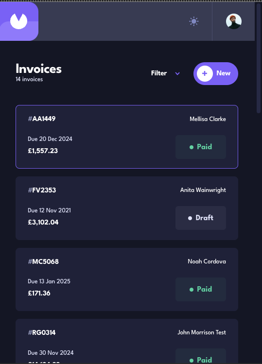

# Frontend Mentor - Invoice app solution

This is a solution to the [Invoice app challenge on Frontend Mentor](https://www.frontendmentor.io/challenges/invoice-app-i7KaLTQjl). Frontend Mentor challenges help you improve your coding skills by building realistic projects.

## Table of contents

- [Overview](#overview)
  - [The challenge](#the-challenge)
  - [Screenshot](#screenshot)
  - [Links](#links)
- [My process](#my-process)
  - [Built with](#built-with)
  - [What I learned](#what-i-learned)
  - [Continued development](#continued-development)
  - [Useful resources](#useful-resources)
- [Author](#author)

## Overview

### The challenge

Users should be able to:

- View the optimal layout for the app depending on their device's screen size
- See hover states for all interactive elements on the page
- Create, read, update, and delete invoices
- Receive form validations when trying to create/edit an invoice
- Save draft invoices, and mark pending invoices as paid
- Filter invoices by status (draft/pending/paid)
- Toggle light and dark mode
- **Bonus**: Keep track of any changes, even after refreshing the browser (`localStorage` could be used for this if you're not building out a full-stack app)

### Screenshot

### Links

- Solution URL: [iou.claims](https://iou.claims)
- Live Site URL: [github repo](https://github.com/mrcordova/invoice-app)

## My process

### Built with

- Semantic HTML5 markup
- CSS custom properties
- Flexbox
- CSS Grid
- Mobile-first workflow

### What I learned

I learned how to host frontend and backend on same domain. I also learned how to work with websockets. How to store images in the backend.

### Continued development

I would like to add two new statuses: past due and owed. The plan is to show when an IOU has not been paid and the date it was due has past. Send reminder to Debtor(person who owes the money) to pay their IOU. The owed status should go to creditor(person owed money) after approving IOU and would show in Creditor's front page.
I am also like to add the functionality of adding images of recipts to IOUs and extract information from recipts. Allow multiple creditors to one IOUs and split debt if necessary. Finally, make website into a PWA(progressive web app);

### Useful resources

- [CSS Custom Checkboxes](https://css3.com/implementing-custom-checkboxes-and-radio-buttons-with-css3/) - Use this to create custom checkboxes like color border, checked color and shape.
- [Show calendar programmatically](https://stackoverflow.com/questions/51334960/how-to-show-calendar-popup-when-inputtype-date-is-on-focus) - The function to call calendar picker in code.
- [Persisting color scheme](https://www.smashingmagazine.com/2024/03/setting-persisting-color-scheme-preferences-css-javascript/) - How to save the color scheme chosen by the user throughout refreshes.
- [How to invoke form errors](https://stackoverflow.com/questions/71939429/programmatically-submit-form-with-submit-events) - How to show form errors when user clickes submit and you don't want default behavior.
- [How select elements based on partail token](https://stackoverflow.com/questions/8714090/how-to-do-a-wildcard-element-name-match-with-queryselector-or-queryselector) - How to choose specific token in id attribute.
- [Test media queries](https://developer.mozilla.org/en-US/docs/Web/CSS/CSS_media_queries/Testing_media_queries) - How to test media queries.
- [How to fix date to your local time](https://stackoverflow.com/questions/7556591/is-the-javascript-date-object-always-one-day-off) - How to set date to your local time.
- [How to add days to date](https://stackoverflow.com/questions/563406/how-to-add-days-to-date) - How to calculate new date based on the addition of days to original date.
- [How to padd form data to backend](https://stackoverflow.com/questions/46640024/how-do-i-post-form-data-with-fetch-api) - How form data is handle when sent to backend.
- [How to open file upload dialog](https://stackoverflow.com/questions/16215771/how-to-open-select-file-dialog-via-js) - How to open the file upload dialog directly.
- [How to save images in node](https://stackoverflow.com/questions/15772394/how-to-upload-display-and-save-images-using-node-js-and-express) - Steps to to manage and save images to the backend.
- [How to add foreign key to table](https://stackoverflow.com/questions/10028214/add-foreign-key-to-existing-table) - How to alter a table in mySql to include a foreign key.
- [Documentaion for tinyurl API](https://tinyurl.com/app/dev) - The Documentaion for the tinyurl api and how to work with the api.

- [socket.io imports](https://cdnjs.com/libraries/socket.io) - Link to include socket.io latest packages to project.

## Author

- Website - [Noah's Website](https://noahs.software)
- Frontend Mentor - [@mrcordova](https://www.frontendmentor.io/profile/mrcordova)
